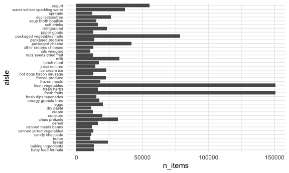

P8105\_hw3\_xw2757
================

``` r
library(tidyverse)
```

    ## ── Attaching packages ─────────────────────────────────────── tidyverse 1.3.1 ──

    ## ✓ ggplot2 3.3.5     ✓ purrr   0.3.4
    ## ✓ tibble  3.1.4     ✓ dplyr   1.0.7
    ## ✓ tidyr   1.1.3     ✓ stringr 1.4.0
    ## ✓ readr   2.0.1     ✓ forcats 0.5.1

    ## ── Conflicts ────────────────────────────────────────── tidyverse_conflicts() ──
    ## x dplyr::filter() masks stats::filter()
    ## x dplyr::lag()    masks stats::lag()

``` r
library(viridis)
```

    ## Loading required package: viridisLite

``` r
library(ggridges)
library(patchwork)

knitr::opts_chunk$set(
  fig.width = 6,
  fig.asp = .6,
  out.width = "90%"
)

theme_set(theme_minimal() + theme(legend.position = "bottom"))

options(
  ggplot2.continuous.colour = "viridis",
  ggplot2.continuous.fill = "viridis"
)

scale_colour_discrete = scale_colour_viridis_d
scale_fill_discrete = scale_fill_viridis_d
```

\#\#Probem 1

``` r
library(p8105.datasets)
data("instacart")
```

**Inspect data**

``` r
summary(instacart) 
```

    ##     order_id         product_id    add_to_cart_order   reordered     
    ##  Min.   :      1   Min.   :    1   Min.   : 1.000    Min.   :0.0000  
    ##  1st Qu.: 843370   1st Qu.:13380   1st Qu.: 3.000    1st Qu.:0.0000  
    ##  Median :1701880   Median :25298   Median : 7.000    Median :1.0000  
    ##  Mean   :1706298   Mean   :25556   Mean   : 8.758    Mean   :0.5986  
    ##  3rd Qu.:2568023   3rd Qu.:37940   3rd Qu.:12.000    3rd Qu.:1.0000  
    ##  Max.   :3421070   Max.   :49688   Max.   :80.000    Max.   :1.0000  
    ##     user_id         eval_set          order_number      order_dow    
    ##  Min.   :     1   Length:1384617     Min.   :  4.00   Min.   :0.000  
    ##  1st Qu.: 51732   Class :character   1st Qu.:  6.00   1st Qu.:1.000  
    ##  Median :102933   Mode  :character   Median : 11.00   Median :3.000  
    ##  Mean   :103113                      Mean   : 17.09   Mean   :2.701  
    ##  3rd Qu.:154959                      3rd Qu.: 21.00   3rd Qu.:5.000  
    ##  Max.   :206209                      Max.   :100.00   Max.   :6.000  
    ##  order_hour_of_day days_since_prior_order product_name          aisle_id    
    ##  Min.   : 0.00     Min.   : 0.00          Length:1384617     Min.   :  1.0  
    ##  1st Qu.:10.00     1st Qu.: 7.00          Class :character   1st Qu.: 31.0  
    ##  Median :14.00     Median :15.00          Mode  :character   Median : 83.0  
    ##  Mean   :13.58     Mean   :17.07                             Mean   : 71.3  
    ##  3rd Qu.:17.00     3rd Qu.:30.00                             3rd Qu.:107.0  
    ##  Max.   :23.00     Max.   :30.00                             Max.   :134.0  
    ##  department_id      aisle            department       
    ##  Min.   : 1.00   Length:1384617     Length:1384617    
    ##  1st Qu.: 4.00   Class :character   Class :character  
    ##  Median : 8.00   Mode  :character   Mode  :character  
    ##  Mean   : 9.84                                        
    ##  3rd Qu.:16.00                                        
    ##  Max.   :21.00

^no missing values

**description of data** The “insatcart” data set has a total of 1384617
observations of 15 variables, including order\_id, product\_id,
add\_to\_cart\_order, reordered, user\_id, eval\_set, order\_number,
order\_dow, order\_hour\_of\_day, days\_since\_prior\_order,
product\_name, aisle\_id, department\_id, aisle, department . There are
a total of 131209 orders, and `count(distinct(instacart, user_id))`
users. Detailed Data structures are as described below:

``` r
str(instacart)
```

    ## tibble [1,384,617 × 15] (S3: tbl_df/tbl/data.frame)
    ##  $ order_id              : int [1:1384617] 1 1 1 1 1 1 1 1 36 36 ...
    ##  $ product_id            : int [1:1384617] 49302 11109 10246 49683 43633 13176 47209 22035 39612 19660 ...
    ##  $ add_to_cart_order     : int [1:1384617] 1 2 3 4 5 6 7 8 1 2 ...
    ##  $ reordered             : int [1:1384617] 1 1 0 0 1 0 0 1 0 1 ...
    ##  $ user_id               : int [1:1384617] 112108 112108 112108 112108 112108 112108 112108 112108 79431 79431 ...
    ##  $ eval_set              : chr [1:1384617] "train" "train" "train" "train" ...
    ##  $ order_number          : int [1:1384617] 4 4 4 4 4 4 4 4 23 23 ...
    ##  $ order_dow             : int [1:1384617] 4 4 4 4 4 4 4 4 6 6 ...
    ##  $ order_hour_of_day     : int [1:1384617] 10 10 10 10 10 10 10 10 18 18 ...
    ##  $ days_since_prior_order: int [1:1384617] 9 9 9 9 9 9 9 9 30 30 ...
    ##  $ product_name          : chr [1:1384617] "Bulgarian Yogurt" "Organic 4% Milk Fat Whole Milk Cottage Cheese" "Organic Celery Hearts" "Cucumber Kirby" ...
    ##  $ aisle_id              : int [1:1384617] 120 108 83 83 95 24 24 21 2 115 ...
    ##  $ department_id         : int [1:1384617] 16 16 4 4 15 4 4 16 16 7 ...
    ##  $ aisle                 : chr [1:1384617] "yogurt" "other creams cheeses" "fresh vegetables" "fresh vegetables" ...
    ##  $ department            : chr [1:1384617] "dairy eggs" "dairy eggs" "produce" "produce" ...
    ##  - attr(*, "spec")=
    ##   .. cols(
    ##   ..   order_id = col_integer(),
    ##   ..   product_id = col_integer(),
    ##   ..   add_to_cart_order = col_integer(),
    ##   ..   reordered = col_integer(),
    ##   ..   user_id = col_integer(),
    ##   ..   eval_set = col_character(),
    ##   ..   order_number = col_integer(),
    ##   ..   order_dow = col_integer(),
    ##   ..   order_hour_of_day = col_integer(),
    ##   ..   days_since_prior_order = col_integer(),
    ##   ..   product_name = col_character(),
    ##   ..   aisle_id = col_integer(),
    ##   ..   department_id = col_integer(),
    ##   ..   aisle = col_character(),
    ##   ..   department = col_character()
    ##   .. )

**1. How many aisles are there, and which aisles are the most items
ordered from?**

``` r
instacart %>% 
  group_by(aisle) %>% 
  summarize(n_items = n()) %>% 
  arrange(desc(n_items))
```

    ## # A tibble: 134 × 2
    ##    aisle                         n_items
    ##    <chr>                           <int>
    ##  1 fresh vegetables               150609
    ##  2 fresh fruits                   150473
    ##  3 packaged vegetables fruits      78493
    ##  4 yogurt                          55240
    ##  5 packaged cheese                 41699
    ##  6 water seltzer sparkling water   36617
    ##  7 milk                            32644
    ##  8 chips pretzels                  31269
    ##  9 soy lactosefree                 26240
    ## 10 bread                           23635
    ## # … with 124 more rows

There are a total of 134 aisles, the most items are ordered from “fresh
vegetables” aisle.

**Make a plot that shows the number of items ordered in each aisle,
limiting this to aisles with more than 10000 items ordered. Arrange
aisles sensibly, and organize your plot so others can read it.**

``` r
instacart %>% 
  group_by(aisle) %>% 
  filter(n()>10000) %>% 
  summarize(n_items = n()) %>%
  ggplot(aes(x = aisle, y = n_items)) +
  geom_bar(stat = "identity") + coord_flip()+ 
  theme(axis.text.y = element_text(size = 6, hjust = 1, vjust=0.5))
```



**Make a table showing the three most popular items in each of the
aisles “baking ingredients”, “dog food care”, and “packaged vegetables
fruits”. Include the number of times each item is ordered in your
table.**

``` r
instacart %>% 
  filter(aisle == c("baking ingredients", "dog food care", "packaged vegetables fruits")) %>% 
  group_by(aisle, product_name) %>% 
  summarize(n_buy=n()) %>% 
  filter(rank(desc(n_buy))<=3) %>% 
  knitr::kable()
```

    ## `summarise()` has grouped output by 'aisle'. You can override using the `.groups` argument.

| aisle                      | product\_name                                   | n\_buy |
|:---------------------------|:------------------------------------------------|-------:|
| baking ingredients         | Light Brown Sugar                               |    157 |
| baking ingredients         | Organic Vanilla Extract                         |    122 |
| baking ingredients         | Pure Baking Soda                                |    140 |
| dog food care              | Organix Chicken & Brown Rice Recipe             |     13 |
| dog food care              | Organix Grain Free Chicken & Vegetable Dog Food |     14 |
| dog food care              | Original Dry Dog                                |      9 |
| packaged vegetables fruits | Organic Baby Spinach                            |   3324 |
| packaged vegetables fruits | Organic Blueberries                             |   1692 |
| packaged vegetables fruits | Organic Raspberries                             |   1920 |

The most popular item in the baking ingredients aisle are light brown
sugar, organic vanilla extract, and pure baking soda. The most popular
item in the dog food care aisle are Organix Chicken & Brown Rice Recipe,
Organix Grain Free Chicken & Vegetable Dog Food, and Original Dry Dog.
The most popular item in thepackaged vegetables fruits aisle are Organic
Baby Spinach, Organic Blueberries, and Organic Raspberries. Number of
items bought are shown in the table.

**Make a table showing the mean hour of the day at which Pink Lady
Apples and Coffee Ice Cream are ordered on each day of the week; format
this table for human readers (i.e. produce a 2 x 7 table).**

``` r
instacart %>% 
  mutate(t_day_number = order_dow + 1) %>% 
  mutate(order_dow  = lubridate::wday(t_day_number, label = TRUE)) %>% 
  filter(product_name == c("Pink Lady Apples", "Coffee Ice Cream")) %>% 
  group_by(product_name, order_dow) %>% 
  summarize(mean_hr = mean(order_hour_of_day)) %>% 
  pivot_wider(
    names_from = order_dow, 
    values_from = mean_hr)
```

    ## Warning in product_name == c("Pink Lady Apples", "Coffee Ice Cream"): longer
    ## object length is not a multiple of shorter object length

    ## `summarise()` has grouped output by 'product_name'. You can override using the `.groups` argument.

    ## # A tibble: 2 × 8
    ## # Groups:   product_name [2]
    ##   product_name       Sun   Mon   Tue   Wed   Thu   Fri   Sat
    ##   <chr>            <dbl> <dbl> <dbl> <dbl> <dbl> <dbl> <dbl>
    ## 1 Coffee Ice Cream  13.2  15    15.3  15.4  15.2  10.3  12.4
    ## 2 Pink Lady Apples  12.2  11.7  12    13.9  11.9  13.9  11.6

Table above shows the mean hour of the day at which Pink Lady Apples and
Coffee Ice Cream are ordered on each day of the week.

\#\#Problem 2

``` r
library(p8105.datasets)
data("brfss_smart2010")
```

**Data cleaning**

``` r
brfss_clean <- 
  brfss_smart2010 %>% 
  janitor::clean_names() %>% 
  filter(topic == "Overall Health",
         response %in% c("Poor", "Fair", "Good", "Very good", "Excellent")) %>% 
  mutate(response = forcats::fct_relevel(response, c("Poor", "Fair", "Good", "Very good", "Excellent")))
```

**In 2002, which states were observed at 7 or more locations? What about
in 2010?**

``` r
brfss_clean %>% 
  filter(year == "2002") %>% 
  group_by(locationabbr) %>% 
  summarize(n_locations = n_distinct(locationdesc)) %>% 
  filter(n_locations >= 7)
```

    ## # A tibble: 6 × 2
    ##   locationabbr n_locations
    ##   <chr>              <int>
    ## 1 CT                     7
    ## 2 FL                     7
    ## 3 MA                     8
    ## 4 NC                     7
    ## 5 NJ                     8
    ## 6 PA                    10

``` r
brfss_clean %>% 
  filter(year == "2010") %>% 
  group_by(locationabbr) %>% 
  summarize(n_locations = n_distinct(locationdesc)) %>% 
  filter(n_locations >= 7)
```

    ## # A tibble: 14 × 2
    ##    locationabbr n_locations
    ##    <chr>              <int>
    ##  1 CA                    12
    ##  2 CO                     7
    ##  3 FL                    41
    ##  4 MA                     9
    ##  5 MD                    12
    ##  6 NC                    12
    ##  7 NE                    10
    ##  8 NJ                    19
    ##  9 NY                     9
    ## 10 OH                     8
    ## 11 PA                     7
    ## 12 SC                     7
    ## 13 TX                    16
    ## 14 WA                    10

In 2002,

and PA were observed at 7 or more locations, in 2010,

Construct a dataset that is limited to Excellent responses, and
contains, year, state, and a variable that averages the data\_value
across locations within a state. Make a “spaghetti” plot of this average
value over time within a state (that is, make a plot showing a line for
each state across years – the geom\_line geometry and group aesthetic
will help). Make a two-panel plot showing, for the years 2006, and 2010,
distribution of data\_value for responses (“Poor” to “Excellent”) among
locations in NY State.
